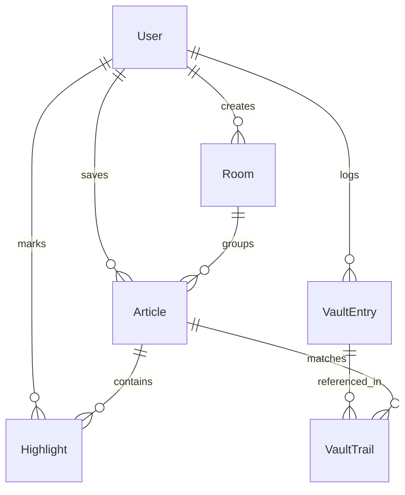

# Developer & Architecture Guide

Welcome to **The Reading Room** codebase. This document outlines the system architecture, code patterns, database conventions, and design learnings to help you quickly build on top of this repository.

---

## 1. System Architecture

The application is built on **Next.js 16 (App Router)** and **React 19**, utilising a Server/Client split:
- **Server Actions/APIs**: Located under `app/api/`. They authenticate user requests using Clerk, query PostgreSQL via Prisma, and perform business logic.
- **Client Components**: Located in `components/` and `app/(dashboard)/**`. They render modern, Scholarly Minimalist layouts using custom styling tokens.

---

## 2. Core Databases & Relations

Our schema in `prisma/schema.prisma` establishes 6 core models:


### Critical Pattern: User Scoping
Never query the database directly using Clerk's string `userId`. Always resolve the Clerk user to the internal database record first to obtain the internal UUID:
```typescript
const { userId } = await auth()
const user = await prisma.user.findUnique({
  where: { clerk_id: userId }
})

// Query using internal User UUID (user.id)
const data = await prisma.room.findMany({
  where: { user_id: user.id }
})
```

---

## 3. Notable Implementations & Workarounds

### A. Selection Range Persistence (React 19 / Turbopack)
In React 19, re-renders triggered by state changes (such as displaying a dictionary popover) can cause DOM nodes to shift or update, which clears the browser's active selection range. 
To bypass this:
- **Solution**: We memoized the document content rendering. By wrapping the document content and search queries in `useMemo` hooks, we ensure that React does not re-create or mutate the article's DOM nodes during state updates, leaving the browser selection highlight active and visible to the user.
- **Dynamic Event Listeners**: We attach the `mouseup` event listener programmatically in `useEffect` on the container reference rather than an inline JSX `onMouseUp` prop to prevent ESLint interactive elements and document-role warnings.

### B. Wikipedia Concept Lookup
The Concept Slide-Over fetches description summaries, thumbnails, and desktop references directly from the public Wikipedia REST API via `/api/vault/lookup/concept`. It features animated skeleton loaders to transition between lookup requests seamlessly.

### C. Insights Analytics Studio
The Insights dashboard compiles:
- Daily contribution activity over a 365-day period (rendered as a CSS grid heatmap).
- Cumulative Vault concept growth over the past 30 days (rendered dynamically via custom SVG curves).
- Horizontal bar comparison chart of article volumes across rooms.
- Consecutive daily reading streaks computed dynamically in PostgreSQL.

---

## 4. What to Build Next

1. **pgvector RAG Search**:
   - Install `pgvector` on your database.
   - Embed article chunks and highlight paragraphs using Google Gemini Embedding APIs.
   - Connect the chat in the **Synthesis Engine** (`app/(dashboard)/insights/page.tsx`) to retrieve contextual citations from your library.
2. **Social Shared Rooms**:
   - Extend `Room` model with `is_public` or a helper table `RoomMember` to support collaborative reading sessions.
