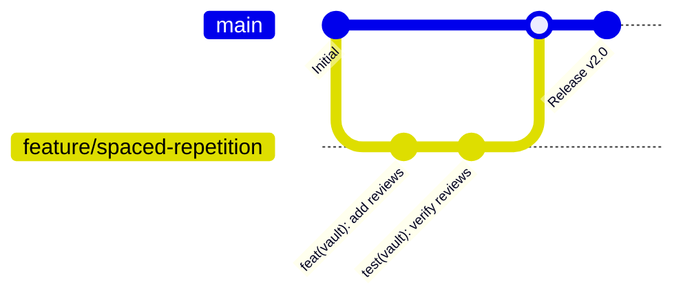

# Git Maintenance & CI/CD Standards

This document establishes development standards, branching strategies, commit conventions, and CI/CD pipeline guidelines for **The Reading Room** repository to maintain code quality and clean delivery.

---

## 1. Git Branching Strategy

To keep the project stable and ensure team members do not overwrite each other's changes, we follow a strict **Feature Branch** workflow:



1. **`main` Branch**:
   * Represents the production state.
   * All code on `main` must compile cleanly and pass all automated tests.
   * Direct pushes to `main` should be restricted. All additions must arrive via Pull Request.
2. **Feature & Bug branches**:
   * Always branch off `main` for new features or bug fixes.
   * Naming convention:
     * Features: `feature/short-description` (e.g. `feature/spaced-repetition`)
     * Bug fixes: `fix/short-description` (e.g. `fix/popover-cutoff`)
     * Chores/Refactoring: `refactor/short-description` or `chore/short-description`

---

## 2. Commit Message Conventions (Conventional Commits)

We use **Conventional Commits** to keep history readable, structured, and easy to parse. Every commit message must follow this format:

```
<type>(<scope>): <description>
```

### Supported Types:
* **`feat`**: A new feature (e.g. `feat(vault): add SM-2 algorithm scheduler`)
* **`fix`**: A bug fix (e.g. `fix(reader): clamp dictionary popover within viewport`)
* **`refactor`**: Code changes that neither fix a bug nor add a feature (e.g. `refactor(save): simplify resolveArticleData cognitive complexity`)
* **`style`**: Markup or CSS design changes (e.g. `style(home): adjust card padding for mobile`)
* **`docs`**: Documentation updates (e.g. `docs(extension): create chrome web store guide`)
* **`test`**: Adding or correcting tests (e.g. `test(sm2): add review boundary test cases`)
* **`chore`**: Maintenance, dependencies, or build tooling (e.g. `chore(ci): add upload artifact steps`)

---

## 3. Pull Request Quality Gates

Before any PR can be merged into `main`, it must pass these automated quality gates verified by our CI pipeline:

1. **Static Analysis & Linting**:
   * `npm run lint` must pass with zero ESLint warnings or errors.
2. **Type Safety Check**:
   * TypeScript must compile successfully: `npx tsc --noEmit`.
3. **Production Compilation**:
   * Next.js must build cleanly: `npm run build`. This step also automatically runs `prebuild` which regenerates the companion Chrome Extension ZIP (`public/extension.zip`).
4. **Unit Test Execution**:
   * All unit tests (`npm test`) must pass. Unlike SonarCloud checks, the CI pipeline is configured to **fail** and block the merge if any single test fails.

---

## 4. Continuous Integration (GitHub Actions)

We have configured a GitHub Action at `.github/workflows/ci.yml` that runs on every PR and commit push to `main`.

### Workflow Steps:
1. **Checkout Code**: Grabs the codebase.
2. **Set up Node.js**: Boots Node.js environment and configures local caching of npm packages to keep builds under 1 minute.
3. **Install Dependencies**: Executes `npm ci` to fetch packages exactly matching `package-lock.json`.
4. **Verify Lint & Types**: Runs ESLint and the TypeScript compiler.
5. **Next.js Build**: Builds the production bundle and packs the Chrome Extension ZIP.
6. **Test Run**: Executes the Node.js test runner suite.
7. **Artifact Upload**: Uploads the freshly compiled `public/extension.zip` directly to the GitHub Action run. This allows developers to download and test the extension matching the exact commit in the pull request.
