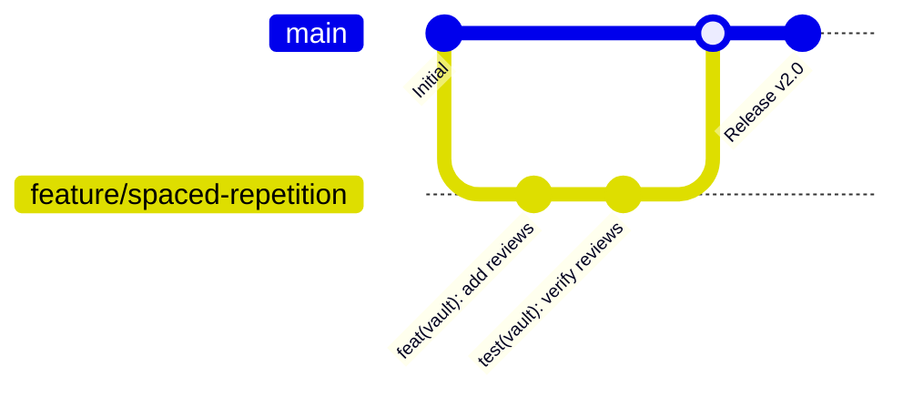

# Git Maintenance & CI/CD Standards

This document establishes development standards, branching strategies, commit conventions, and CI/CD pipeline guidelines for **The Reading Room** repository to maintain code quality and clean delivery.

---

## 1. Git Branching Strategy

To keep the project stable and ensure team members do not overwrite each other's changes, we follow a strict **Feature Branch** workflow:



1. **`main` Branch**:
   - Represents the production state.
   - All code on `main` must compile cleanly and pass all automated tests.
   - Direct pushes to `main` should be restricted. All additions must arrive via Pull Request.
2. **Feature & Bug branches**:
   - Always branch off `main` for new features or bug fixes.
   - Naming convention:
     - Features: `feature/short-description` (e.g. `feature/spaced-repetition`)
     - Bug fixes: `fix/short-description` (e.g. `fix/popover-cutoff`)
     - Chores/Refactoring: `refactor/short-description` or `chore/short-description`

---

## 2. Commit Message Conventions (Conventional Commits)

We use **Conventional Commits** to keep history readable, structured, and easy to parse. Every commit message must follow this format:

```
<type>(<scope>): <description>
```

### Supported Types:

- **`feat`**: A new feature (e.g. `feat(vault): add SM-2 algorithm scheduler`)
- **`fix`**: A bug fix (e.g. `fix(reader): clamp dictionary popover within viewport`)
- **`refactor`**: Code changes that neither fix a bug nor add a feature (e.g. `refactor(save): simplify resolveArticleData cognitive complexity`)
- **`style`**: Markup or CSS design changes (e.g. `style(home): adjust card padding for mobile`)
- **`docs`**: Documentation updates (e.g. `docs(extension): create chrome web store guide`)
- **`test`**: Adding or correcting tests (e.g. `test(sm2): add review boundary test cases`)
- **`chore`**: Maintenance, dependencies, or build tooling (e.g. `chore(ci): add upload artifact steps`)

---

## 3. Local Pre-Commit Hooks (Husky & lint-staged)

To prevent code with linter errors from ever entering the git history, we use **Husky** and **lint-staged**:

- Every time you run `git commit`, Husky runs the pre-commit hook.
- This hook runs `npx lint-staged`, which executes `eslint --fix` on only the files you modified (staged).
- **If there is a linter error that cannot be resolved automatically, the commit is blocked.** You must fix the error before you can successfully commit.

---

## 4. Pull Request Quality Gates

Before any PR can be merged into `main`, it must pass these automated quality gates verified by our CI pipeline:

1. **Static Analysis & Linting**:
   - `npm run lint` must pass with zero ESLint warnings or errors.
2. **Type Safety Check**:
   - TypeScript must compile successfully: `npx tsc --noEmit`.
3. **Production Compilation**:
   - Next.js must build cleanly: `npm run build`. This step also automatically runs `prebuild` which regenerates the companion Chrome Extension ZIP (`public/extension.zip`).
4. **Unit Test Execution**:
   - All unit tests (`npm test`) must pass. The CI pipeline will fail and block the merge if any single test fails.

---

## 5. Continuous Integration (GitHub Actions)

We have configured two GitHub Action workflows inside `.github/workflows/`:

1. **`ci.yml`**: Runs linting, type checks, production builds, unit tests, and uploads the compiled extension ZIP as a build artifact.
2. **`sonarcloud.yml`**: Runs SonarCloud code quality analysis and generates coverage reports.

---

## 6. Locking the `main` Branch in GitHub Settings

To enforce these quality gates, repository administrators must configure **Branch Protection Rules** on GitHub:

1. Go to your repository on GitHub.
2. Click **Settings** (top tab) -> **Branches** (left menu).
3. Under **Branch protection rules**, click **Add branch protection rule** (or edit the rule for `main`).
4. Set **Branch name pattern** to `main`.
5. Check **Require a pull request before merging**.
6. Check **Require status checks to pass before merging**.
7. In the search bar for status checks, search and select:
   - `Build, Lint, and Test` (enforces ESLint, TypeScript compilation, Next.js build, and unit tests).
   - `SonarCloud Code Analysis` (enforces SonarCloud scan and quality gates).
8. Check **Require branches to be up to date before merging** (forces developers to resolve conflicts before merging).
9. Check **Do not allow bypassing the above settings** (forces admins to follow rules too).
10. Click **Save changes**.

<!-- Verification Check Passed -->
