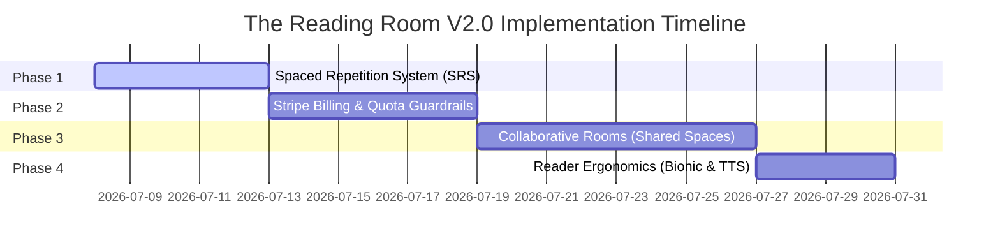

# The Reading Room — Version 2.0 Roadmap & Technical Specification

This document outlines the strategic roadmap, architectural specifications, and implementation details for **Version 2.0** of The Reading Room. It is structured into executable phases, enabling systematic pair-programming and feature rollouts.

---

## 🎯 V2.0 Core Themes

1. **Shared Knowledge (Collaboration)**: Turn isolated reading workspaces into shared intellectual spaces.
2. **Spaced Repetition & Retention (Active Recall)**: Move from passive highlighting to active vocabulary and concept retention.
3. **Monetization (Pro Tier)**: Build Stripe billing infrastructure and enforce usage quotas for basic vs. premium tiers.
4. **Enhanced Reading Ergonomics**: Add Bionic Reading, Text-to-Speech (TTS), and advanced annotators (underlines, margin comments).

---

## 🛠️ Feature Specifications & Technical Design

### 1. Collaborative Rooms (Shared Spaces)
* **Goal**: Allow users to invite collaborators to a Room. Members can read the same articles, see shared highlights, and participate in a shared Room AI Chat.
* **Database Schema Updates**:
  ```prisma
  // Join table for Room membership and access control
  model RoomMember {
    id         String   @id @default(uuid())
    room_id    String
    user_id    String
    role       String   // "owner" | "editor" | "viewer"
    joined_at  DateTime @default(now())
  
    room       Room     @relation(fields: [room_id], references: [id], onDelete: Cascade)
    user       User     @relation(fields: [user_id], references: [id], onDelete: Cascade)
  
    @@unique([room_id, user_id])
  }
  ```
* **API Endpoints**:
  * `POST /api/rooms/[id]/members`: Invite a collaborator (by email).
  * `DELETE /api/rooms/[id]/members/[memberId]`: Remove a collaborator or revoke access.
  * `GET /api/rooms/[id]/activity`: Retrieve audit trails of who highlighted what and when.
* **UI Additions**:
  * "Invite Member" dialog inside `ManageRoomDialog`.
  * Collaborative presence indicator (avatars showing who is active in the room).

---

### 2. Spaced Repetition (SRS) Flashcards
* **Goal**: Turn the Vocabulary Vault into an active learning center. Implement a SuperMemo-2 (SM-2) algorithm for vocabulary flashcards, triggering daily reviews.
* **Database Schema Updates**:
  ```prisma
  model FlashcardProgress {
    id             String   @id @default(uuid())
    vault_entry_id String   @unique
    interval       Int      @default(0)   // In days
    repetition     Int      @default(0)   // Number of consecutive successful recalls
    ease_factor    Float    @default(2.5) // Difficulty multiplier
    next_review    DateTime @default(now())
  
    vaultEntry     VaultEntry @relation(fields: [vault_entry_id], references: [id], onDelete: Cascade)
  }
  ```
* **API Endpoints**:
  * `GET /api/vault/review`: Fetch today's due cards.
  * `POST /api/vault/review/[id]`: Grade recall rating (0 to 5) and recalculate the next review interval using the SM-2 algorithm.
* **UI Additions**:
  * `/vault/review` page: A distraction-free flashcard interface with keyboard shortcuts (Space to flip, 1-5 keys for grading).
  * "Due Today" banner on `/home` and `/vault`.

---

### 3. Stripe Billing & Quota Enforcement (Pro Tier)
* **Goal**: Introduce a SaaS tier structure. Free users are limited, while Pro users have unrestricted access.
* **Tiers & Quotas**:
  * **Free Tier**: Max 1 Room, Max 5 saved articles, basic AI chat.
  * **Pro Tier ($8/month)**: Unlimited Rooms/articles, collaborative features, full Gemini synthesis engine access.
* **Database Schema Updates**:
  * Update `User` model to track Stripe Subscription status:
  ```prisma
  model User {
    // ... existing fields
    stripe_customer_id       String?   @unique
    stripe_subscription_id   String?   @unique
    stripe_price_id          String?
    subscription_status      String?   // "active" | "canceled" | "past_due"
    trial_ends_at            DateTime?
  }
  ```
* **Integration Points**:
  * `POST /api/billing/checkout`: Create a Stripe Checkout Session for subscription.
  * `POST /api/billing/webhook`: Process Stripe webhooks (`customer.subscription.updated`, `invoice.payment_succeeded`).
* **Middleware/Route Guard Check**:
  * Check quotas prior to creating rooms or ingesting articles. Show a custom Upgrade Dialog if limits are exceeded.

---

### 4. Advanced Reader Controls
* **Bionic Reading Mode**:
  * **Mechanism**: Highlight the first 40-50% of each word (e.g., **Bi**onic **Rea**ding) using custom regex parsing to guide the eye and improve reading speed.
  * **UI Toggle**: Add a "Bionic" toggle inside the Reader Appearance Dropdown.
* **Text-to-Speech (TTS)**:
  * **Mechanism**: Integrate Web Speech API (native browser synthesis) or OpenAI TTS API for audio playback of reading texts.
  * **UI Bar**: Floating audio player bar (Play, Pause, Speed Control, Skip 10s).

---

### 5. Gemini AI Auto-Tagging
* **Goal**: Automatically analyze article content during ingestion and generate descriptive tags/concepts.
* **Mechanism**:
  * During the POST `/api/articles/save` pipeline, run a background Gemini completion prompt to extract 3-5 tags based on taxonomy.
  * Save tags into database metadata.

---

## 📅 V2.0 Implementation Phase Schedule



### Phase 1: Spaced Repetition (Active Recall)
* [ ] Database migration for `FlashcardProgress` table.
* [ ] SM-2 calculation utility functions.
* [ ] Daily review card selection API endpoints.
* [ ] Distraction-free review UI component and card flip flow.

### Phase 2: Stripe Billing Integration
* [ ] Database migration for Stripe subscription fields.
* [ ] Stripe webhook handler route with signature verification.
* [ ] Quota check middleware shims in database write operations.
* [ ] Pricing Page layout and upgrade modals.

### Phase 3: Collaborative Rooms
* [ ] Database migration for `RoomMember` table.
* [ ] Invitations flow (email validation and token checking).
* [ ] Scoped DB queries to retrieve rooms where user is either the owner OR a member.
* [ ] Shared presence and live activity indicators.

### Phase 4: Reader Enhonomics
* [ ] Bionic Reading token parsing functions.
* [ ] Web Speech API synthesis controls wrapper.
* [ ] Auto-tagging triggers in the article save API pipeline.
